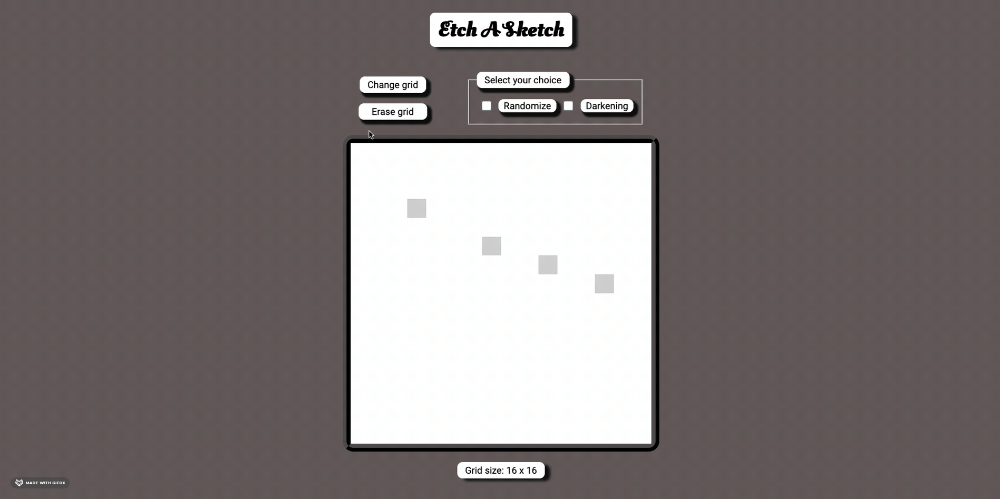

  <h1>Etch A Sketch</h1>

  Something like a Sketchpad or an Etch A Sketch ([live preview](https://ohgrmait.github.io/etch-a-sketch/))

  

## About
This project shows a browser version of a GUI-based sketching interface that resembles something between a sketchpad and and an [Etch-A-Sketch](https://en.wikipedia.org/wiki/Etch_A_Sketch).[^1]

[^1]: [This project](https://www.theodinproject.com/lessons/foundations-etch-a-sketch) is from the [Foundations Course](https://www.theodinproject.com/paths/foundations/courses/foundations) in [The Odin Project](https://www.theodinproject.com/about).

## Showcase

  
  
This is a screenshot of the index page.

  
  
This is another screenshot of the index page.

  
  
This is a screen cast of the progressive darkening effect (single color).

  
  
This is a screen cast of the progressive darkening effect (multi color).

  
  
This is a screen cast of changing and erasing the grid squares.

## Technologies
- ***Git***
- ***CLI***
- ***HTML***
- ***GitHub***
- ***JavaScript***
- ***GitHub Pages***

## Self Reflections
- > Nothing significant to add after the [previous project](https://github.com/ohgrmait/rock-paper-scissors) except that this was much harder and getting stuff done for the extra credits was worth the time and patience. The only thing that proved to be helpful was looking at the documentation, googling, stackoverflow-"ing" and others.

## Acknowledgements
- Credit for README goes to [ritaly's README cheatsheet](https://github.com/ritaly/README-cheatsheet) and [ArjunSaili1's comment](https://github.com/TheOdinProject/curriculum/discussions/25472#discussioncomment-5889343).

## Contact and Support
- Please do not hesitate to contact me at ***ohgrmait_02945*** on discord for any project queries.
- This project will no longer be worked upon and no further support will be provided for this project.[^2]

[^2]: The [TOP strategy guide](https://dev.to/theodinproject/learning-code-f56) makes it clear to [focus on the point of the assignment](https://dev.to/theodinproject/learning-code-f56#:~:text=Focus%20on%20the%20point%20of%20the%20assignment) and that [foundations isn't a strong portfolio generator](https://dev.to/theodinproject/learning-code-f56#:~:text=Foundations%20isn%E2%80%99t%20a%20strong%20portfolio%20generator), so I won't be wasting anymore time here.